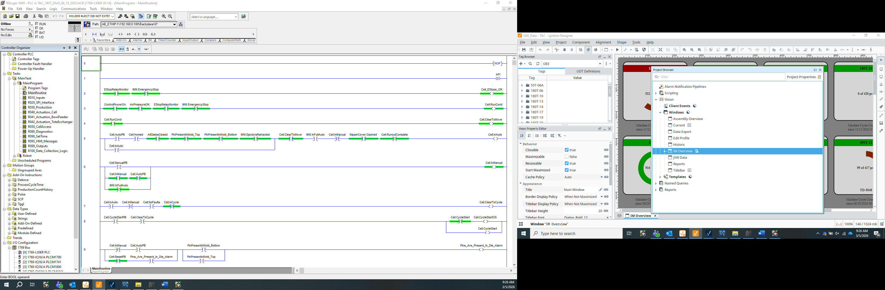
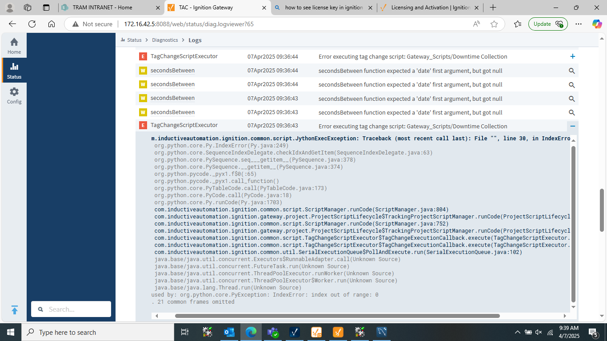
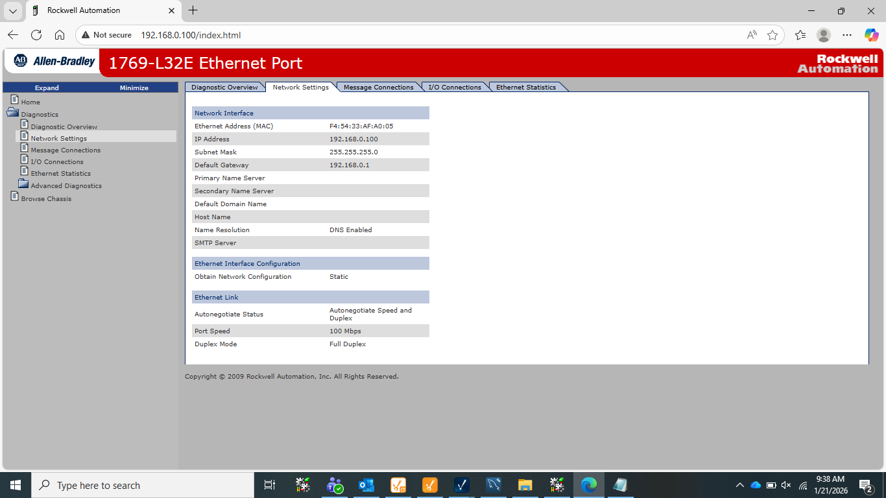

# SCADA Communication & Grid Operations Support Lab

## Project Overview
This project simulates a SCADA environment used in industrial automation and grid operations. 
The goal was to understand how SCADA systems monitor, communicate, and troubleshoot industrial devices 
such as PLCs, field sensors, and HMI systems.

The lab demonstrates communication using industrial protocols, real-time monitoring, and troubleshooting 
common operational issues.

---

## Technologies Used

- PLC Programming (Allen Bradley / Studio 5000)
- SCADA Platform (Ignition SCADA)
- Industrial Communication Protocols
  - Modbus TCP
  - DNP3
- Networking
  - TCP/IP
  - Port diagnostics
- Database
  - MySQL
- Automation scripting (Jython in Ignition)

---

## System Architecture

The simulated SCADA architecture includes:

PLC → Network → SCADA Gateway → Database → HMI Dashboard

Components used:

- PLC controller
- Ignition SCADA gateway
- MySQL database
- Industrial communication protocols
- HMI visualization

---

## Features Implemented

- PLC ladder logic for machine operations
- SCADA tag configuration and monitoring
- Database logging for production data
- HMI dashboards for operational visibility
- Alarm and event monitoring
- Communication troubleshooting

---

## Example PLC Logic

PLC ladder logic controls machine states and signals.

---

## SCADA Tag Configuration

Tags were configured in Ignition to monitor machine data and production values.

---

## SCADA Error Monitoring

Ignition gateway logs were analyzed to troubleshoot script and data errors.

---

## Network Diagnostics

TCP connections were monitored to verify communication between SCADA and field devices.

---

## PLC Network Configuration

PLC Ethernet configuration including IP addressing and communication parameters.

---

## Port Connectivity Testing

Port connectivity was tested using PowerShell and TCP diagnostics.

---

## Troubleshooting Scenarios Tested

The following failure scenarios were intentionally introduced:

- Incorrect PLC IP configuration
- Port communication failure
- SCADA script errors
- Database query issues
- Network connectivity failures

Each issue was analyzed using logs, network tools, and SCADA diagnostics.

---

## Key Learning Outcomes

- Understanding SCADA system architecture
- Industrial communication protocols
- Troubleshooting distributed automation systems
- Monitoring real-time industrial data
- Diagnosing network and protocol issues

---

## Future Improvements

- Implement additional industrial protocols
- Add automated alarm notifications
- Integrate advanced analytics dashboards

---
